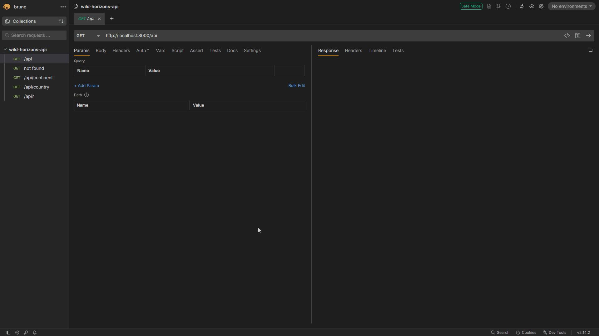

# Desafio Backend Node.js – Wild Horizons API



API simples construída **apenas com o módulo http nativo do Node.js** (sem Express ou qualquer framework externo).

## Objetivo do desafio

Criar um servidor HTTP do zero que exponha dados de países/continentes com os seguintes requisitos:
- Filtrar países por nome, continente ou parâmetros de query
- Retornar JSON com headers corretos
- Tratar rotas e query strings manualmente
- Implementar códigos de status apropriados (200, 404)

## Funcionalidades implementadas

| Rota                                  | Método | Descrição                                           | Exemplo de resposta                                      |
|---------------------------------------|--------|-----------------------------------------------------|----------------------------------------------------------|
| `GET /api`                            | GET    | Lista todos os países                               | `[{ "country": "Brazil", "continent": "South America", ... }]` |
| `GET /api/continent/:continent`       | GET    | Filtra por continente (ex: `/api/continent/asia`)   | Países da Ásia                                           |
| `GET /api?country=:name`              | GET    | Busca por nome do país                              | `[{"country":"Turkey", ...}]`                            |
| `GET /api?...` (múltiplos filtros)    | GET    | Suporta vários query params (ex: `?country=turkey&is_open_to_public=true`) | Países que atendem a todos os filtros |

## Estrutura do projeto

```
.
├── data
│   ├── data.js           → Array com ~250 países
│   └── database.js       → Simula banco (apenas exporta data.js)
├── utils
│   ├── filterData.js     → Lógica de filtragem reutilizável
│   ├── filterQueryData.js→ Filtra a partir de query string
│   └── sendJSON.js       → Helper para respostas JSON padronizadas
├── package.json
├── README.md
├── server.js             → Servidor HTTP nativo + roteamento
└── TODO                  → Ideias do projeto
```

## Tecnologias utilizadas

- Node.js >= 22 (apenas módulo `http` nativo)
- Nenhum framework ou dependência externa
- Dados estáticos em memória

## Como executar

```bash
# 1. Clone o repositório
git clone https://github.com/obrnocsta/wild-horizons-api.git

# 2. Entre na pasta
cd wild-horizons-api

# 3. Instale (não há dependências, mas o package.json ajuda)
npm install

# 4. Inicie o servidor
npm start
```

Servidor rodará em **http://localhost:8000**

## Exemplos de requisições

```bash
# Todos os países
curl http://localhost:8000/api

# Países da Europa
curl http://localhost:8000/api/continent/europe

# Busca por nome + filtro
curl "http://localhost:8000/api?country=brazil&is_open_to_public=true"

```

## Tratamento de erros

- `404` → Rota não encontrada
- `400` → Parâmetros inválidos

## Critérios atendidos

✔ Código limpo e bem organizado  
✔ Separação clara de responsabilidades  
✔ Boas práticas (funções puras, helpers reutilizáveis)  
✔ Commits semânticos e históricos claros  
✔ README completo e direto  
✔ 100% módulo http nativo (sem Express ou libs externas)

Feito com ☕ por [Bruno Costa](https://github.com/obrnocsta) – Pronto para produção (ou quase!).